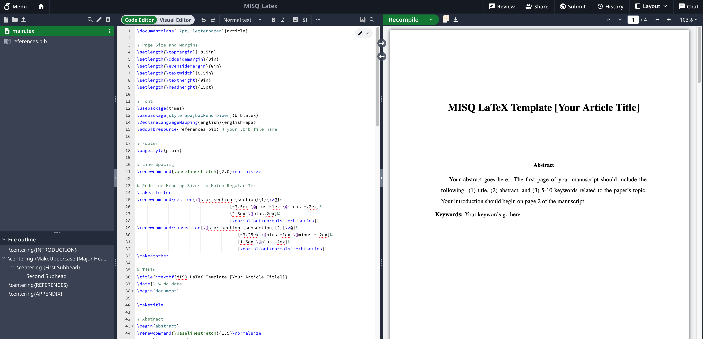
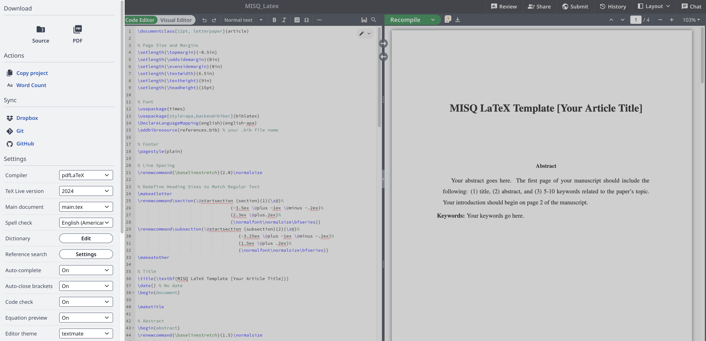

# MIS Quarterly Latex Submission Format
Based on the official LaTeX format, this version includes a corrected bibliography that adheres to APA 7th edition guidelines. The unofficial version (https://github.com/pcbouman-eur/misq-latex-style) does not fully match the formatting of the Word template provided on the MISQ portal. Therefore, we have revised the references to align with the official MISQ format, based on the original .tex file, which used a manual approach.

Please compile using pdfLaTeX

## Instructions to use the Latex Format
Upload tex and bib files on your brand new overleaf project 

Double Check your compiler

